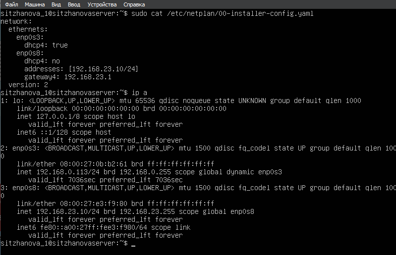
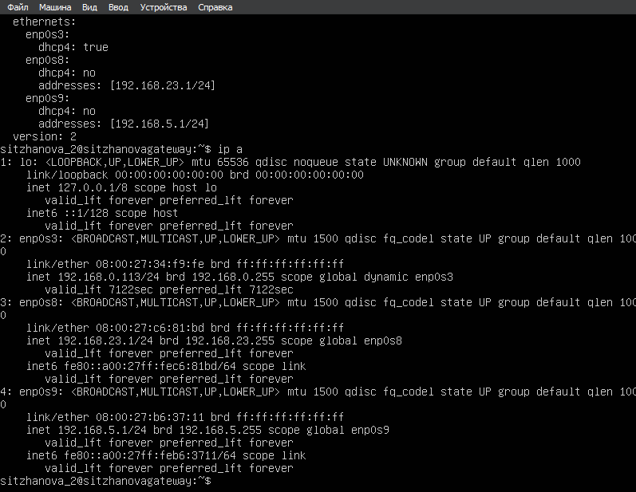
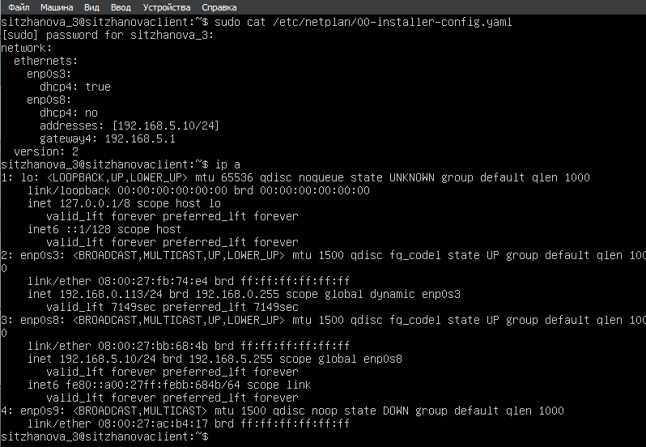
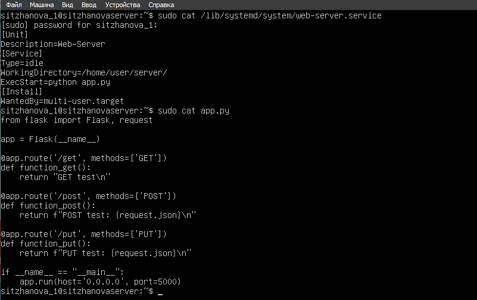
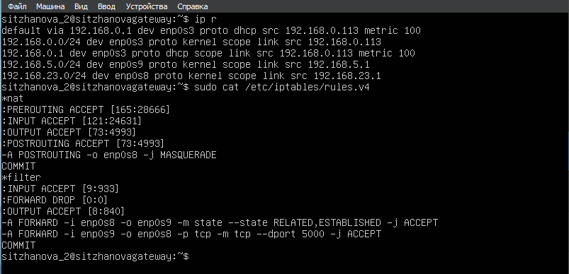
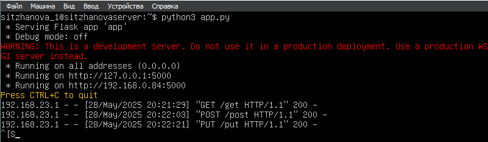
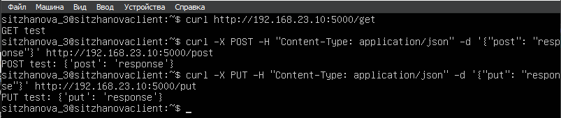
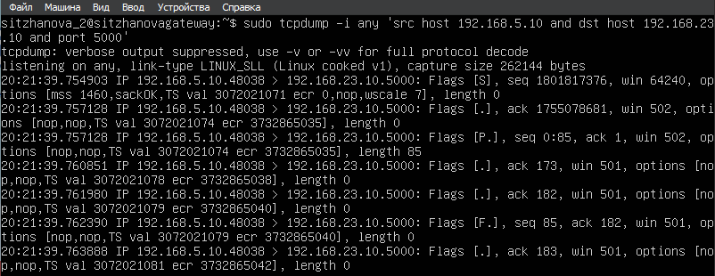
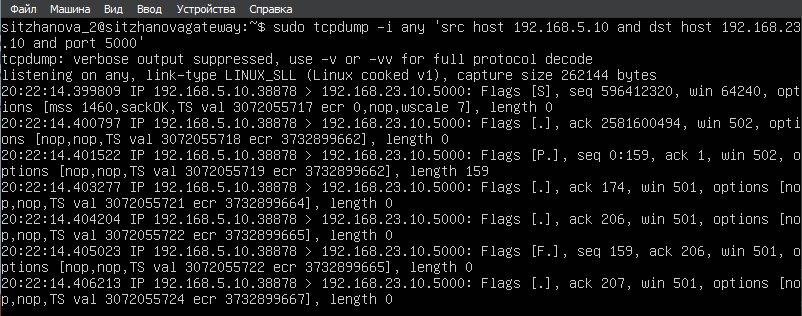
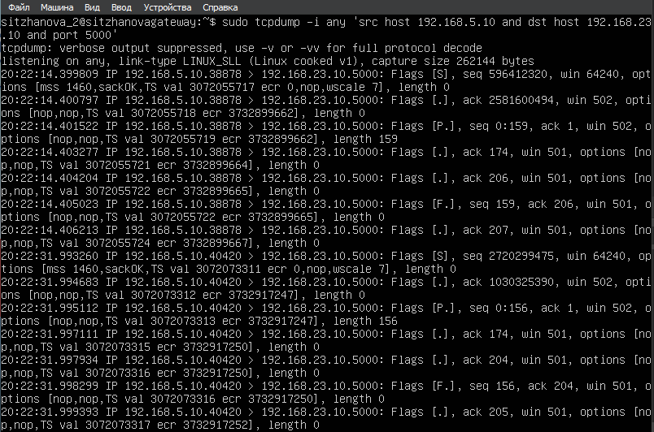

# Отчёт по работе №1: Практика Linux (VirtualBox)

**Этап 1: Создание виртуальных машин и настройка пользователей.**
Создаём одну ВМ на основе скачанного образа и создаём две её копии.
Далее настраиваем сетевые адаптеры по заданию (две подсети: servernet и clientnet + сетевой мост).
После этого на каждой машине вручную задаем новый hostname и user.
```shell
    1. Linux A: user=sitzhanova_1, hostname=sitzhanovaserver
    2. Linux B: user=sitzhanova_2, hostname=sitzhanovagateway
    3. Linux C: user=sitzhanova_3, hostname=sitzhanovaclient
```

<br><br>

**Этап 2: Netplan конфигурации.**
Необходимо переписать конфиги *netplan* согласно заданию и применить их командой *sudo netplan apply*:





<br>

На Linux А был для 'enp0s3' был выставлен автоматический айпи-адрес, а для 'enp0s8' - "192.168.23.10/24".
На Linux B был для 'enp0s3' был также выставлен автоматический айпи-адрес, для 'enp0s8' - "192.168.23.1/24", а для enp0s9 - "192.168.5.1/24".
На Linux С был для 'enp0s3' выставлен автоматический айпи-адрес, а для 'enp0s8' - "192.168.5.1/24".

<br><br>

**Этап 3: Донастройка каждой виртуальной машины.**
*Linux A*:<br>
Необходимо реализовать простое приложение на Flask (предварительно скачав его и Python) с тремя эндпоинтами (/get, /post, /put), 
а также написать под него сервис, задача которого состоит в запуске приложение через автозагрузку:



<br>

*Linux B*:<br>
Необходимо настроить iptables для маршрутизации пакетов от машины A до машины C с фильтрацией пакетов по 5000-му порту:
Также необходимо включить ip_forward в настройках системы:



<br><br>

**Этап 4: Тестирование системы.**
*Linux A*:<br>
Запускаем на Linux A приложение командой `python3 app.py` и проверяем, на каких адресах работает. <br>

*Linux B*:<br>
Запускаем `tcpdump` для просмотра логов передачи пакетов между клиентом и сервером. <br>

*Linux С*:<br>
Отправляем три запроса (/get, /post, /put) для проверки:







Представленные скриншоты подтверждают работоспособность системы: все виртуальные машины успешно настроены, связь и фильтрация пакетов налажена, а Flask приложение отрабатывает все запросы.
